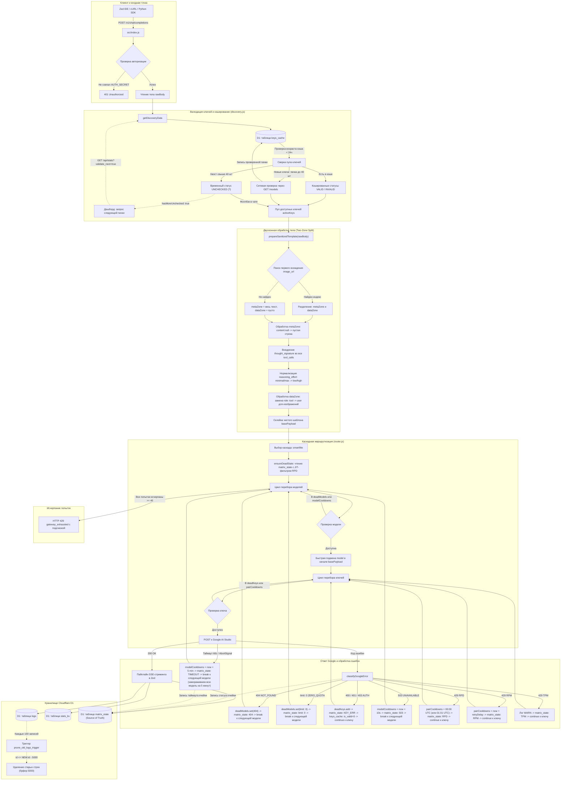

# Архитектура и логика работы шлюза

В данном документе представлена подробная схема работы Gemini Edge Gateway, включая алгоритм проверки и валидации ключей, двухзонную обработку тела запроса (Two-Zone Split), ротацию каскадов, единый источник состояния матрицы `matrix_state` и сохранение логов в базу данных SQLite D1.

## Схема архитектуры



## Просмотр логов шлюза

### Веб-дашборд

Базовый мониторинг логов и матрица статусов доступны прямо на главной странице воркера в браузере:
`https://gemini-edge-gateway.{ваш_поддомен}.workers.dev/`

Здесь выводятся события в реальном времени, время ответа (RTT), задействованные модели, идентификаторы ключей и HTTP-статусы.

### Консоль Cloudflare D1 для полного анализа ошибок

Если вам требуются полные дампы ответов Google API (содержимое поля `details`, полные тексты сообщений об ошибках, метрики квот и заголовки), вы можете выполнить прямой SQL-запрос в веб-консоли базы данных Cloudflare D1:

- перейдите в [Cloudflare Dashboard](https://dash.cloudflare.com/)
- в левом боковом меню перейдите: **Storage & Databases** -> **D1 SQL Database**
- выберите базу данных `gemini-gateway-db` (ссылка формата `https://dash.cloudflare.com/{account_id}/workers/d1/databases/{database_id}/console`)
- перейдите на вкладку **Console**

Выполните SQL-запрос для получения последних 100 записей с полным текстом ошибок:

```sql
SELECT timestamp, level, message, model, key_id, status, duration_ms, details
FROM logs
ORDER BY timestamp DESC
LIMIT 100;
```

Колонка `details` содержит оригинальный JSON-ответ с подробностями ошибки от Google AI Studio (объекты `QuotaFailure`, ссылки `Help`, поля `retryDelay` и параметры лимитов).
